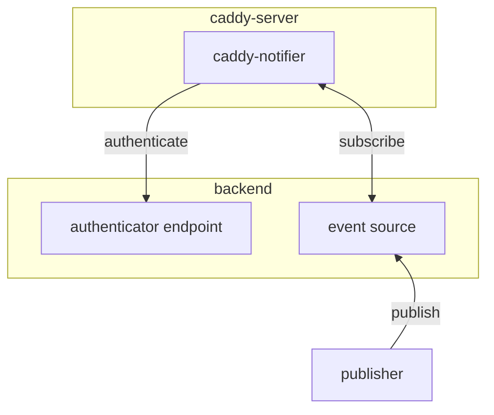

# Caddy Notifier

Design under construction...

## Design



Subscribers are connected via WebSocket interface and subscriber is able to subscribe to specific channel via subscribe event.

Authenticator endpoint is queried by the caddy-notifier to authenticate the subscribe operations. Base on the response from the authenticator, the caddy-notifier notifies the subscribe success / fail results.

When subscriber subscribes a channel successfully, the subscriber will receive events from subscribed channel. The events are consumed from an event source. The publishers are responsible as an event producer.

### Considerations

1. Introduce of a centralized event source (possible implemented by Redis Pub/Sub) for single source of truth and decouple of subscriber and publisher
2. When subscriber disconnected from the notifier, it needs to re-subscribe all channels needed, to eliminate requirement of session storage (stateful session)
3. (?) The channel name could be in hierarchy structure like `submission/domain_id`. If subscriber subscribes a prefix like `submission` (?all=1), it receives events on `submission` and all child channels. (? or the publisher just publish events with different channel)
4. For subscriber (? maybe certain optional parameter `after` can be added to receive buffered message. How it defines? If timestamp, we need to ensure time sync, If message id, we need to ensure it incremental correctly. Or we just send all buffered message and let subscriber to deduplicate)

### Safety Considerations

1. Although `de-authorize` provided method to ensure no left-over subscriptions, token that expires by time may need extra watch dog (? or provide `valid_until` field in authenticator response)
2. Maybe need to limit the number of channel single connection can connect to
3. Do we allow multiple connection to use the same credential? (maybe from different page, or consolidate via web worker)
4. Do we want to limit the rate of sending out events? Due to event fan-out nature, there must be write-amplification effect. In this case, do we consider certain event have higher priority or certain event could be dropped when rate limited.

### Protocol

#### subscriber to caddy-notifier

##### auth

It should be the first message send to caddy-notifier. When credential changed, it should call this again, and all channel need to be resubscribed.

```json
{
    "operation": "auth",
    "token": "xxx"
}
```

When authenticator decline the connection, the WebSocket connect should be closed immediately.

After receive this message, caddy-notifier records the credential for this connection. If no credential received for substantial amount of time, the connection will be closed (? or allow not credential connections).

##### subscribe

```json
{
    "operation": "subscribe",
    "channel": "xxx"
}
```

The caddy-notifier will request authenticator with recorded credential to authenticate, whether subscribe request accepted or rejected. Channel specified channel to be subscribed (? or list of channels). (? or reject directly if reach certain subscription limit).

##### unsubscribe

```json
{
    "operation": "unsubscribe",
    "channel": "xxx"
}
```

The caddy-notifier will remove the subscriber from the channel subscription. If certain channel is not subscribed, it will be no-op. After unsubscribe, the subscriber will no longer receive message from that channel.

#### caddy-notifier to subscriber

##### subscribe results

```json
{
    "operation": "subscribed",
    "channel": "xxx"
}
```

The caddy-notifier notifies the subscriber on the decision from the authenticator.

```json
{
    "operation": "unsubscribed", (?)
    "channel": "xxx"
}
```

Rejected (? or de-authorized or unsubscribed)

##### Events

```json
{
    "operation": "event",
    "channel": "xxx",
    "payload": { event content }
}
```

#### caddy-notifier to authenticator

##### connect

Request:

```json
{
    "operation": "connect",
    "token": "xxx"
}
```

Response:

```json
{
    "operation": "accept / reject"
}
```

##### subscribe

Request:

```json
{
    "operation": "subscribe",
    "channel": "channel_name",
    "token": "xxx"
}
```

Response:

```json
{
    "operation": "accept / reject"
}
```

#### event source to caddy-notifier

##### notify

```json
{
    "operation": "notify",
    "channel": "xxx",
    "payload": { event contents }
}
```

caddy-notifier will notifier all subscriber in the specific channel (? or list of channels)

##### de-authorize

```json
{
    "operation": "deauthorize",
    "token": "xxx"
}
```

De-authorize certain credential = unsubscribe from all channels for that credential. Ensure no subscription retained when credential expires / invalidated.
