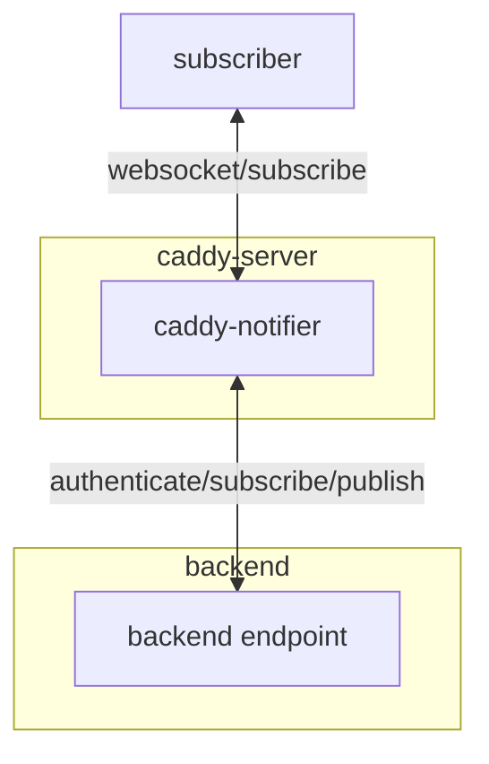

# Caddy Notifier

Design under construction...

## Design

The caddy-notifier works as WebSocket consolidator, that consolidate multiple WebSocket connections into logical channels.

1. To reduce the number reverse connection from caddy to backend
2. Simplifies message distribution workflows



Subscribers are connected via WebSocket interface and subscriber is able to subscribe to specific channel via subscribe event. When subscriber subscribes a channel successfully, the subscriber will receive events from subscribed channel.

Backend endpoint are connected via WebSocket and responsible to authenticate subscribers and publish event to channels.

### Considerations

1. When subscriber disconnected from the notifier, it needs to re-subscribe all channels needed, to eliminate requirement of session storage (eliminate stateful session)
2. For subscriber (? maybe certain optional parameter `after` can be added to receive buffered message. How it defines? If timestamped, we need to ensure time sync, If message id, we need to ensure it incremental correctly. Or we just send all buffered message and let subscriber deduplicate)
3. Metrics (prefix `caddy_websocket_notifier_*`)
   1. Number of event sent (`event_sent_total`)
   2. Number of event requested (`event_requested_total`)
   3. number of subscribe event (`subscribe_requested_total`)
   4. current connection count (`active_connection`)
   5. number of subscriptions (`active_subscription`)
   6. current channel count (`channel_count`)
   7. upstream status (`upstream_healthy`)
   8. inbound message size (`websocket_inbound_bytes_total`)
   9. outbound message size (`websocket_outbound_bytes_total`)
   10. outbound compressed message size (`websocket_outbound_compressed_bytes_total`)
   11. number of subscriber in channel per category (defined by `channel_category`) (`subscriber_count`)
   12. current message in worker channel (`worker_channel`)
   13. message throttled by worker channel (`worker_throttled_total`)

### Safety Considerations

1. Although `de-authorize` provided method to ensure no left-over subscriptions, token that expires by time may need extra watch dog (? or provide `valid_until` field in authenticator response)
2. Maybe need to limit the number of channel single connection can connect to
3. Do we allow multiple connection to use the same credential? (maybe from different page, or consolidate via web worker)
4. Do we want to limit the rate of sending out events? Due to event fan-out nature, there must be write-amplification effect. In this case, do we consider certain event have higher priority or certain event could be dropped when rate limited.
5. Do we want to limit the subscribe rate for single connection?

### Packages

- [gorilla/websocket](https://github.com/gorilla/websocket) will be the key package to upgrade incoming and outbound connections, for its ease of use and reliability. Although [nbio](https://github.com/lesismal/nbio) claimed to be able to handle 1 M connections with non-blocking strategies. It needs special listener, which is essentially incompatible with the Caddy setup.

### Caddyfile

```caddyfile
{
    metrics
    log notifier {
        level DEBUG
        include http.handlers.websocket_notifier
    }
}

:6080 {
    websocket_notifier /ws "ws://localhost:6081/ws" {
        write_wait 10s
        pong_wait 60s
        ping_interval 50s
        max_message_size 256k # max incoming message size from subscriber
        chan_size 16
        recovery_wait 5s

        header_up +TEST_HEADER "value"
        header_down -TEST_HEADER "value"

        compression shorty
        shorty_reset_count 1000
        ping_type text # send text "ping" message to subscribers

        metadata key "value"
        channel_category "regexp" "category"
    }
}
```

Debug Log Hierarchy:

- http.handlers.websocket_notifier
  - subscriber.{remote_addr}:{remote_port}
  - upstream
    - maintainer
    - conn
    - hub

## TODO

- [x] De-authorize
- [x] Metrics
- [ ] Rate limit (?)
- [ ] Message Buffer

### Protocol

The client sent of `ping` message will be treated as `ping`, and the client sent of `shorty` message will be treated as `shorty` compression enable operation.

#### subscriber to caddy-notifier

##### subscribe

```json
{
    "operation": "subscribe",
    "request_id": "request id",
    "credential": "a string token for authentication",
    "channels": ["a list of string value for channel name"]
}
```

The caddy-notifier will request backend with credential to authenticate, whether subscribe request accepted or rejected. Channel specified channel to be subscribed. (? or reject directly if reach certain subscription limit). `request_id` will be pass through to the backend.

##### unsubscribe

```json
{
    "operation": "unsubscribe",
    "request_id": "request id",
    "channels": ["a list of string values for channel name"]
}
```

The caddy-notifier will remove the subscriber from the channel subscription. If certain channel is not subscribed, it will be no-op. After unsubscribe, the subscriber will no longer receive message from that channel.

##### resume

```json
{
    "operation": "resume",
    "resume_token": "resume_token",
    "seq": 123
}
```

If a connection disconnected from the notifier, and it tries to reconnect, the subscriber can send a `resume` request with a secret token to resume previous subscription.

#### caddy-notifier to subscriber

##### subscribe results

```json
{
    "operation": "verify",
    "request_id": "request id sent previously",
    "accept": ["a list of channel_name"],
    "reject": ["a list of channel_name"],
    "resume_token": "resume_token"
}
```

When subscriber successfully subscribe / rejected for certain subscribe request, the list of accepted / rejected channel will be returned with a `resume_token` to resume previous subscription if disconnected.

##### resume results

```json
{
    "operation": "resume_success",
    "channel": ["a list of channels in previous subscription"]
}
```

```json
{
    "operation": "resume_failed"
}
```

##### unsubscribe results

The caddy-notifier notifies the subscriber on the decision from the authenticator.

```json
{
    "operation": "unsubscribed",
    "channels": ["a list of channel_name"],
}
```

De-authorized sent out `unsubscribed` events.

##### Events

```json
{
    "operation": "event",
    "channels": ["a list of channel_name"],
    "seq": 123,
    "payload": { "event content":  "can be any valid JSON structure" }
}
```

When a subscriber subscribes to multiple channel in the list, the event will be sent out once. `seq` is the sequential increasing `id` to resume subscription and should be provided with `resume` request.

#### caddy-notifier to backend

##### subscribe

```json
{
    "subscription_id": "identifier to distinct different connections",
    "request_id": "request id",
    "operation": "subscribe",
    "channels": ["a list of channel_name"],
    "credential": "xxx",
    "metadata": {"metadata_key": "metadata_value"}
}
```

##### unsubscribe

When last subscriber of a list of subscriber desubscribed / deauthorized / disconnected, the backend will be notified with `unsubscibe` so that backend is acknowledge there's no longer a subscriber to a specific channel.

```json
{
    "subscription_id": "identifier to distinct different connections",
    "channels": ["a list of channel_name"],
}
```

##### resume

The caddy-notifier sends `resume` with list of channels that have been subscribed when reconnected to the back-end.

```json
{
    "operation": "resume",
    "channels": ["a list of channels that being subscribed"]
}
```

#### backend to caddy-notifier

##### subscribe result

```json
{
    "subscription_id": "identifier to distinct different connections",
    "request_id": "identifier sent previously via request",
    "operation": "verify",
    "accept": ["a list of channel_name of accepted channels"],
    "reject": ["a list of channel_name of rejected channels"],
}
```

##### event

```json
{
    "operation": "event",
    "channels": ["a list of channel_name"],
    "payload": { "event contents" }
}
```

caddy-notifier will notifier all subscriber in the specific channel (? or list of channels)

##### de-authorize

```json
{
    "operation": "deauthorize",
    "credential": "xxx"
}
```

De-authorize certain credential = unsubscribe from all channels for that credential. Ensure no subscription retained when credential expires / invalidated.
