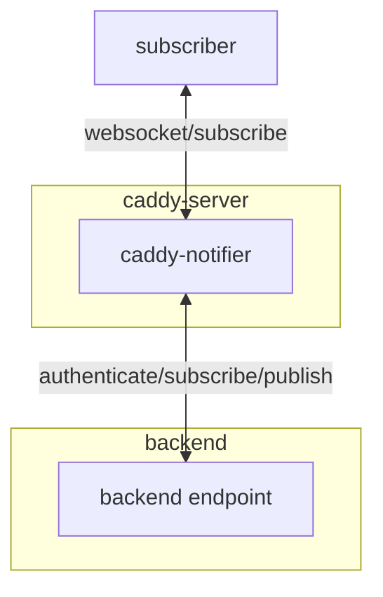

# Caddy Notifier

Design under construction...

## TODO

- [x] De-authorize
- [x] Metrics
- [ ] Rate limit (?)

## Design

The caddy-notifier works as WebSocket consolidator, that consolidate multiple WebSocket connections into logical channels.

1. To reduce the number reverse connection from caddy to backend
2. Simplifies message distribution workflows



Subscribers are connected via WebSocket interface and subscriber is able to subscribe to specific channel via subscribe event. When subscriber subscribes a channel successfully, the subscriber will receive events from subscribed channel.

Backend endpoint are connected via WebSocket and responsible to authenticate subscribers and publish event to channels.

### Considerations

1. When subscriber disconnected from the notifier, it needs to re-subscribe all channels needed, to eliminate requirement of session storage (stateful session)
2. For subscriber (? maybe certain optional parameter `after` can be added to receive buffered message. How it defines? If timestamp, we need to ensure time sync, If message id, we need to ensure it incremental correctly. Or we just send all buffered message and let subscriber to deduplicate)
3. ~~(?) The channel name could be in hierarchy structure like `submission/domain_id`. If subscriber subscribes a prefix like `submission` (?all=1), it receives events on `submission` and all child channels. (? or the publisher just publish events with different channel)~~ (consider attribute match or other techniques later)
4. Metrics ?
   1. Number of message sent
   2. number of subscribe event
   3. current connection count
   4. current channel count
   5. upstream status

### Safety Considerations

1. Although `de-authorize` provided method to ensure no left-over subscriptions, token that expires by time may need extra watch dog (? or provide `valid_until` field in authenticator response)
2. Maybe need to limit the number of channel single connection can connect to
3. Do we allow multiple connection to use the same credential? (maybe from different page, or consolidate via web worker)
4. Do we want to limit the rate of sending out events? Due to event fan-out nature, there must be write-amplification effect. In this case, do we consider certain event have higher priority or certain event could be dropped when rate limited.
5. Do we want to limit the subscribe rate for single connection?
6. Do we want to limit the number of channels in single request?

### Packages

- [gorilla/websocket](https://github.com/gorilla/websocket) will be the key package to upgrade incoming and outbound connections, for its ease of use and reliability. Although [nbio](https://github.com/lesismal/nbio) claimed to be able to handle 1 M connections with non-blocking strategies. It needs special listener, which is essentially incompatible with the Caddy setup.

### Caddyfile

```caddyfile
:6080 {
    websocket_notifier /ws "ws://localhost:6081/ws" {
        write_wait 10s
        pong_wait 60s
        ping_interval 50s
        max_message_size 256k # max incoming message size from subscriber / upstream
        chan_size 16
        recovery_wait 5s
    }
}
```

### Protocol

#### subscriber to caddy-notifier

##### subscribe

```json
{
    "operation": "subscribe",
    "credential": "a string token for authentication",
    "channels": ["a list of string value for channel name"]
}
```

The caddy-notifier will request backend with credential to authenticate, whether subscribe request accepted or rejected. Channel specified channel to be subscribed. (? or reject directly if reach certain subscription limit).

##### unsubscribe

```json
{
    "operation": "unsubscribe",
    "channels": ["a list of string values for channel name"]
}
```

The caddy-notifier will remove the subscriber from the channel subscription. If certain channel is not subscribed, it will be no-op. After unsubscribe, the subscriber will no longer receive message from that channel.

#### caddy-notifier to subscriber

##### subscribe results

```json
{
    "operation": "subscribed",
    "channels": ["a list of channel_name"],
}
```

The caddy-notifier notifies the subscriber on the decision from the authenticator.

```json
{
    "operation": "unsubscribed", (?)
    "channels": ["a list of channel_name"],
}
```

Rejected (? or de-authorized or unsubscribed)

##### Events

```json
{
    "operation": "event",
    "channels": ["a list of channel_name"],
    "payload": { event content }
}
```

? When a subscriber subscribes A&B and the event is oriented to A&B. Do we send 2 events, or make channel also a list? (deduplication)

#### caddy-notifier to backend

##### subscribe

```json
{
    "connection_id": "identifier to distinct different connections",
    "operation": "subscribe",
    "channels": ["a list of channel_name"],
    "credential": "xxx"
}
```

? Do we want to notify backend about unsubscribes?

#### backend to caddy-notifier

##### subscribe result

```json
{
    "connection_id": "identifier to distinct different connections",
    "operation": "accept / reject",
    "credential": "credential for the accepted channel, must present if deauthorize requested", 
    "channels": ["a list of channel_name"],
}
```

##### notify

```json
{
    "operation": "notify",
    "channels": ["a list of channel_name"],
    "payload": { "event contents" }
}
```

caddy-notifier will notifier all subscriber in the specific channel (? or list of channels)

##### TODO de-authorize

Not implemented yet. It would need to record credential -> list of (websocket, channels) and websoket -> list of credential, which is hard to implement correctly during prototype phase.

```json
{
    "operation": "deauthorize",
    "credential": "xxx"
}
```

De-authorize certain credential = unsubscribe from all channels for that credential. Ensure no subscription retained when credential expires / invalidated.
